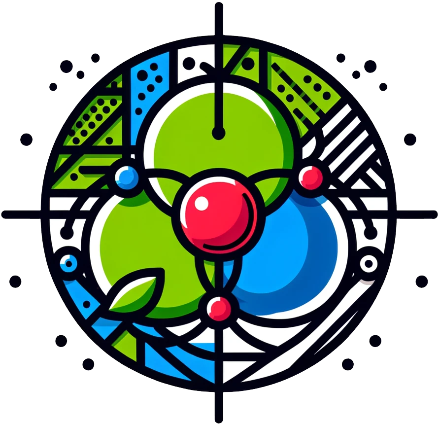

[日本語](./README.md) | [English](./README_en-US.md)

#  Project Sansa（プロジェクトサンサ）とは

ProjectSansa（プロジェクトサンサ、以下 Sansa）とは、ざっくりいうと、こんなのあったら使いたいxRオープンプラットフォームから始まり、VR / AR / MR / 非XR を横断する xRシステム構想になりました。  
プロジェクト名のサンサは「現実世界」「仮想世界」「理想」が交差する三叉をイメージして名付けました。  
個人プロジェクトとして開始していますが、面白そうと思ったら誰でも参加歓迎です。

[Discord](https://discord.gg/wN67tdzrCT)

---

## 1. 実現したいこと

結構な大風呂敷になりますが、最終的には、スマートフォンに代わる新しいパーソナルデバイスとサービス基盤を作りたいと考えています。  
主に自分で使いたいがために。

Sansa では、VR / AR / MR / 非XR を1つのサービスとして扱います。

- 非XR: 通話・コミュニケーション
- AR: 現実空間との情報重畳
- VR: 仮想空間SNS
- MR: 現実空間と仮想空間の融合

これらは簡単な操作で切り替えられ、現実世界と仮想世界を自然につなぐことを目指しています。
また、Sansa 単体ではなく、他の VRSNS やサービスとも接続・連携できるオープンな構成を目指しています。  
そして、UGC(User Generated Content)の発展を後押しするため、権利関係や経済圏に関する仕組みも組み込んでいきたいです。

---

## 2. 本リポジトリの位置づけ

本リポジトリは ProjectSansaの全体構想や、Sansaシリーズの紹介および導線の役割を持ちます。  
また、Sansaシリーズの共通認識、特に用語については本リポジトリの管理下で共有します。  
ProjectSansaでは、Sansaシリーズ共通の用語・運用・LLM連携方針を提供しています。  
各Sansaシリーズは、それらを参照して運用することを推奨します。

詳細は、以下のドキュメントを参照してください。  
利用シーンなどのアイデアもこちらに記載しています。

- [ProjectSansa 目次](./docs/ja-JP/目次.md)

## 3. 各Sansaシリーズの紹介

<table>

<tr><td>

### [SansaSphere（サンサスフィア）](https://github.com/mayusaki3/SansaSphere)

ProjectSansa利用者の認証や、権利処理・来歴情報・検証・経済圏等の基盤部分を担当します。  
いわゆるポータルサイト機能も持ちます。

### 現在の状況
- 設計中

`ポータルサイト` `アカウント` `認証` `権利処理` `来歴情報` `検証` `経済圏`
</td></tr>

<tr><td>

### [SansaVRM（サンサブイアールエム）](https://github.com/mayusaki3/SansaVRM)

VRM = Virtual Reality Models です。  
ProjectSansaが扱うコンテンツデータフォーマットで、アバターやワールドオブジェクトなどを扱います。

フォーマット内に複数モデルを格納でき、権利情報以外に来歴情報や利用条件、対価に関する情報等も入れることができます。  
あくまでフォーマットですので改ざんは防げませんが、流通させる場合は SansaSphere への登録を行えば、SansaSphere に問い合わせることで改ざん検知や、対価の評価（利用状況や全体の何パーセントが取り分か？等）などが可能になる想定です。

### 現在の状況
- 設計中

`フォーマット` `glTF` `許諾情報` `来歴情報` `経済圏`
</td></tr>

<tr><td>

### [SansaVRM Studio AI（サンサブイアールエムスタジオエーアイ）](https://github.com/mayusaki3/SansaVRM-Studio-AI)

SansaVRMコンテンツの作成環境です。  
基本的な編集機能に加え、AIによる創作サポートを可能にします。  
AIサポートについては、ProjectSansaでAIサービスを提供するのではなく、各個人がローカルAIを構築し、それを利用する想定になります。  
創作時点ではエログロだろうと何だろうと創作できるべきで、それを流通させようとした段階でポリシー違反かどうかを判断する考え方です。

### 現在の状況
- 設計中

`SansaVRM` `AI生成` `編集` `変換` `組み立て` `許諾情報` `来歴情報` `経済圏`
</td></tr>

<tr><td>

### [SansaXR（サンサエックスアール）](https://github.com/mayusaki3/SansaXR)

いわゆるXRSNSシステムで、SansaVRMコンテンツが利用可能。
ProjectSansaの実現したいこと、の大半がここに集約されています。

### 現在の状況
- 設計中

`XRSNS` `OpenXR` `O3DE` `SansaVRM`
</td></tr>

<tr><td>

### [SansaCloth（サンサクロース）](https://github.com/mayusaki3/SansaCloth)

SansaXR用シェーダーで、主に服などの表現UPを狙ったものです。  
本来メッシュ変形で実現しなければならない表現を、シェーダー側で処理するようにしたものです。  
各環境用に展開したいです。

### 現在の状況
- 未着手

`SansaVRM` `シェーダー` `PC` `Android` `iOS`
</td></tr>

<tr><td>

### [SansaVRM MuJoCo Adapter（サンサブイアールエムムジョコアダプター）](https://github.com/mayusaki3/SansaVRM-MuJoCo-Adapter)

SansaVRMフォーマットから、外部物理シミュレータであるMuJoCo用フォーマットに変換するためのアダプターです。  

### 現在の状況
- 設計中

`SansaVRM` `MuJoCo`
</td></tr>

</table>

---
© 2020 ProjectSansa
