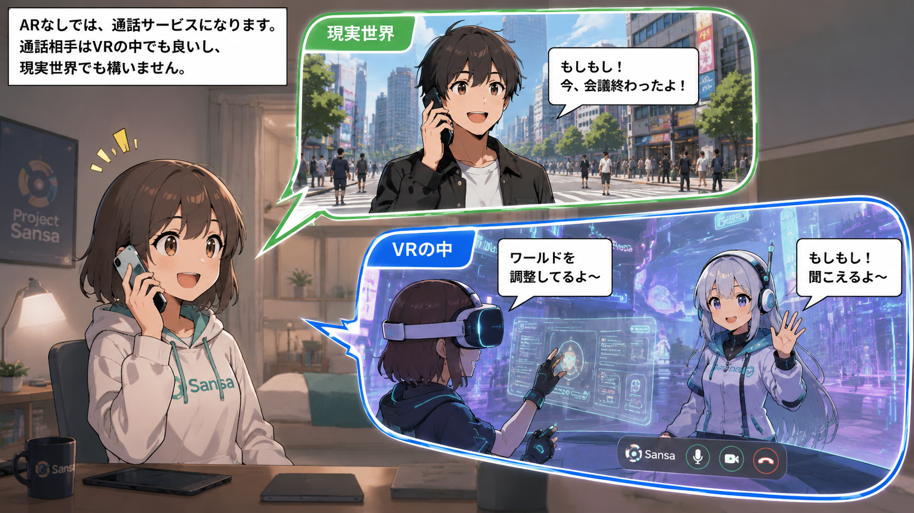
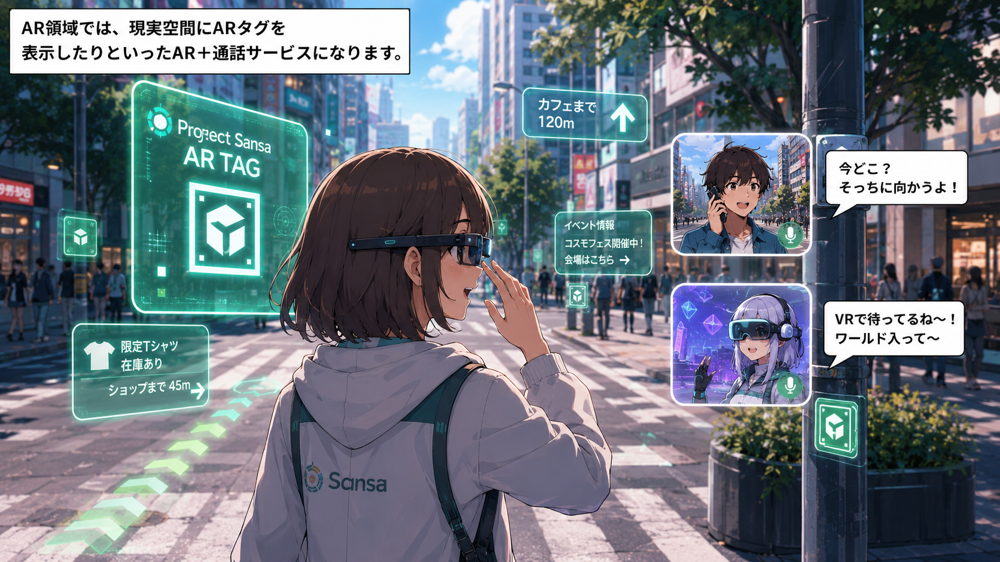
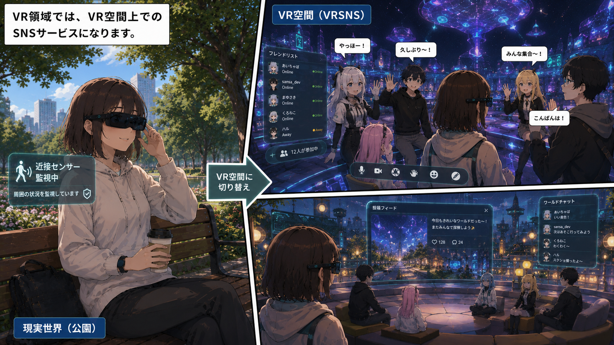
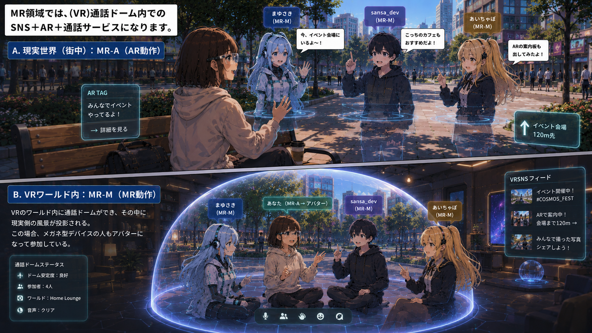
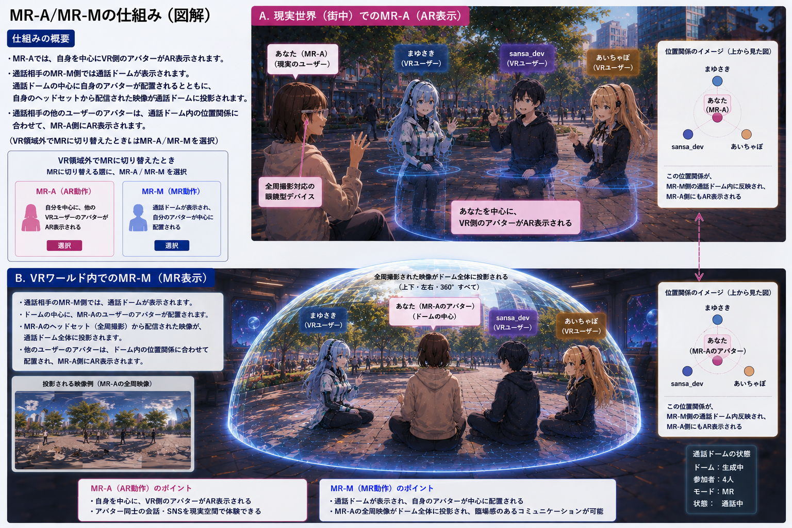
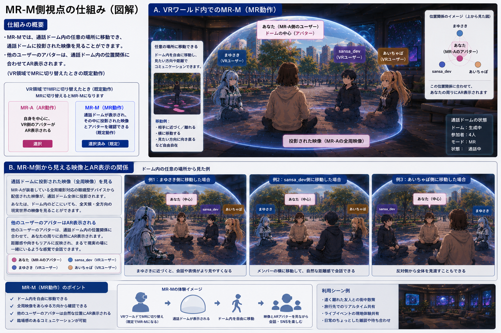
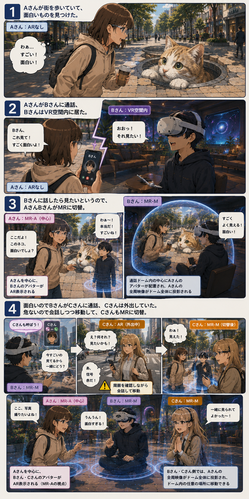
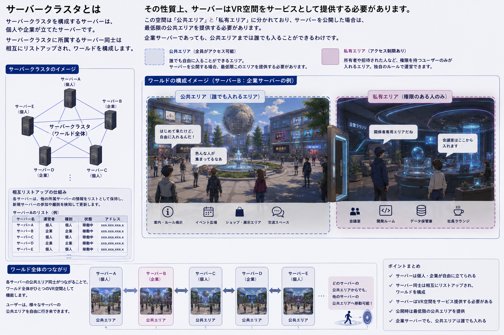

<!--
HLDocS:LLM-MANAGED
doc_id: doc-20200619-010100Z-2FA5
lang: ja-JP
canonical_title: 初期アイデアと利用シーン
document_type: note
canonical_document: true
-->

[目次](./目次.md) > 初期アイデアと利用シーン

# 初期アイデアと利用シーン

これらは最初期案（2020年6月19日）のアイデアです。  
すべてを実現するわけではありません。

## 1. 実現したいこと
結構な大風呂敷になりますが、最終的には、スマートフォンに代わる新しいパーソナルデバイスとサービス基盤を作りたいと考えています。
主に自分で使いたいがために。

Sansa では、VR / AR / MR / 非XR を1つのサービスとして扱います。

非XR: 通話・コミュニケーション
AR: 現実空間との情報重畳
VR: 仮想空間SNS
MR: 現実空間と仮想空間の融合
これらは簡単な操作で切り替えられ、現実世界と仮想世界を自然につなぐことを目指しています。 また、Sansa 単体ではなく、他の VRSNS やサービスとも接続・連携できるオープンな構成を目指しています。
そして、UGC(User Generated Content)の発展を後押しするため、権利関係や経済圏に関する仕組みも組み込んでいきたいです。

## 2. 利用シーン

### 2.1 基本サービス

xRという事でSansaではVRからARおよびARなしまでのいくつかの領域を１つのサービスでサポートします。

- ARなしでは、通話サービスになります。通話相手はVRの中でも良いし、現実世界でも構いません。

- AR領域では、現実空間にARタグを表示したりといったAR＋通話サービスになります。

- VR領域では、VR空間上でのSNSサービスになります。

 

- MR領域では、(VR)通話ドーム内でのSNS＋AR＋通話サービスになります。この領域では誰か１人がAR動作(MR-A)、他の人はMR動作(MR-M)となります。

MR領域での各動作は次の通り。

#### MR-A 接続 ( Mixed Reality - Augmented Reality 接続 )

MR-Aでは、自身を中心にVR側のアバターがAR表示されます。通話相手のMR-M側では通話ドームが表示されます。通話ドームの中心に自身のアバターが配置されるとともに、自身のヘッドセットから配信された映像が通話ドームに投影されます。  
通話相手の他のユーザーのアバターは、通話ドーム内の位置関係に合わせて、MR-A側にAR表示されます。  
（VR領域外でMRに切り替えたときはMR-A/MR-Mを選択）  

#### MR-M 接続 ( Mixed Reality - Mixed Reality 接続 )

MR-Mでは、通話ドーム内の任意の場所に移動でき、通話ドームに投影された映像を見ることができます。  
他のユーザーのアバターは、通話ドーム内の位置関係に合わせてAR表示されます。  
（VR領域でMRに切り替えたときの既定動作）

---

#### 利用シナリオ

これらの領域・動作は、簡単な操作で、切り替えられます。  
例えば、次のようなシナリオです。

1. Aさんが街を歩いていて、面白いものを見つけた。（Aさん:ARなし）

2. AさんがBさんに通話、BさんはVR空間内に居た。（Aさん:ARなし、Bさん:VR）

3. Bさんに話したら見たいというので、AさんBさんがMRに切替。（Aさん:MR-A、Bさん:MR-M）

4. 面白いのでBさんがCさんに通話、Cさんは外出していた。（Aさん:MR-A、Bさん:MR-M、Cさん:AR）  
   危ないので会話しつつ移動して、CさんもMRに切替。（Aさん:MR-A、Bさん:MR-M、Cさん:MR-M）

ライブなども、現地参加とVR参加を一緒にみたいなことができるので、状態の情報提供を条件にVR参加者は何割引かで参加できるみたいなシナリオも考えられます。 企業なら視察にも使えるし、下見なども概念がかなり変わるのでは。

---

### 2.2 その他の機能

その他実現したい機能を挙げてしておきます。

#### タイムキャプチャ機能
あるルーム／ワールドに対する入力データの時間情報付きキャプチャができる。
これを再生した時にルーム／ワールド及びアバターなどのデータがあれば、その時の再現ができる。

#### デスクトップ連携機能
クライアントPCのデスクトップをキャプチャして、スライドや写真・動画などを通話ドーム内やVRSNS内の任意の場所に投影できる。

#### 統合認証機能
サーバークラスタ全体として認証を行える仕組みを実現します。

#### VRSNSランチャー機能
Sansaから、他のVRSNSに切り替える機能をサポートします。

---

### 2.3 その他のアイデア

#### システム構成など

持続性の観点から、特定企業のみがサービスを提供する形ではなく、誰でもサービスを提供できて、企業もそれに乗る形にしたいと考えています。  
そのため、ベース部分はオープンソースで、オリジナル要素はクローズドで実装みたいにしたいです。
また、商取引や世界に１つだけのアイテムみたいなことを実現するために、ブロックチェーンの仕組みなんかも取り入れたいですね。  

ハードウェア的な構成は、サーバー、クライアントPC、ヘッドセットの、いわゆるPC VRと変わらないもの、と考えています。  
クライアントPCにサーバーのソフトウェアを入れて同居させることも検討したいです。 スタンドアロン型ヘッドセットは、レンダリングをヘッドセットが行いますが、稼働時間なども考慮し、ARタグ表示などの非力な範囲に限定し、MR～VR領域のレンダリングはクライアントPCが受け持ちことになります。  
ヘッドセットについては、網膜投影ディスプレイなども入手可能になっていますし、試作までできたらいいかな。  

#### サーバークラスタ

サーバークラスタを構成するサーバーは、個人や企業が立てたサーバーです。  
サーバークラスタに所属するサーバー同士は相互にリストアップされ、ワールドを構成します。  

その性質上、サーバーはVR空間をサービスとして提供する必要があります。  
この空間は公共アリアと私有エリアに別れており、サーバーを公開した場合は、最低限の公共エリアを提供する必要があります。  
企業サーバーであっても、公共エリアまでは誰でも入ることができるわけです。  

#### クライアントPC

クライアントPCはクラウドVM前提ですが、クライアントソフトウェアは無償で手持ちのPCにインストールして利用できます。  
企業はクラウドVMをサブスクリプションの形で提供することもできます。  
なお、サーバーソフトウェアと同居することも可能です。  

#### ヘッドセット

基本的にARヘッドセットになります。発信側がVR内の場合、シナリオにあっとように会話しながら周りの安全を確保してVR内にそのまま移動できるものですが、ヘッドセットの特性上、フルトラはできません。  
ヘッドセットはトラッキング用のカメラを持ち、そのカメラにより映像を送信します。  

視覚障害者向けの音のxRのみのヘッドセットも標準仕様に入れたいです。  

---

[目次](./目次.md) > 初期アイデアと利用シーン
