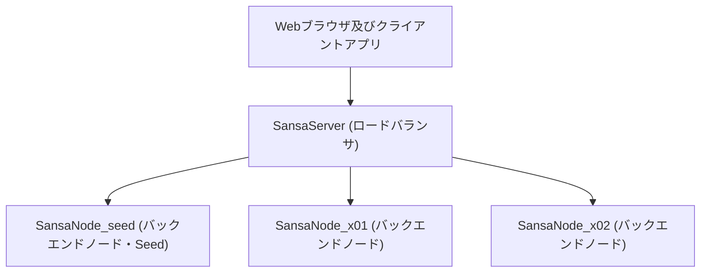
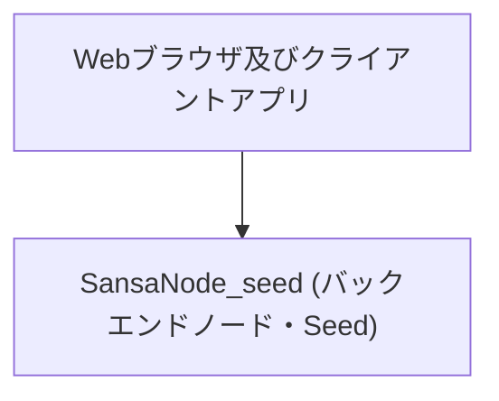

[目次](../目次.md) > サーバー環境構築 概要

## はじめに
この資料は、SansaXRサーバーの環境構築資料です。  
このサーバーがユーザーポータルサイトとなります。  
実際にサービスを提供する場合も同様の構成になります。  

## 標準構成
本資料では、以下の構成を想定しています。

４台ともWebサーバーとしてNginxを使用し、ロードバランサとバックエンドを構成します。
バックエンドの３台にはサーバーアプリを配置し、Nginxで公開します。
データベースはCassandraを使用し、バックエンドの３台でクラスタを構成します。
各ノードのサーバーアプリは自ノードのCassandraと情報をやり取りし、Cassandraによりノード間が同期されます。  
スケールアップはノードを追加することで対応します。  
サーバーOSについてはUbuntuを使用します。

## 最小構成
最小構成は次のようになります。

***
[目次](../目次.md) > サーバー環境構築 概要
