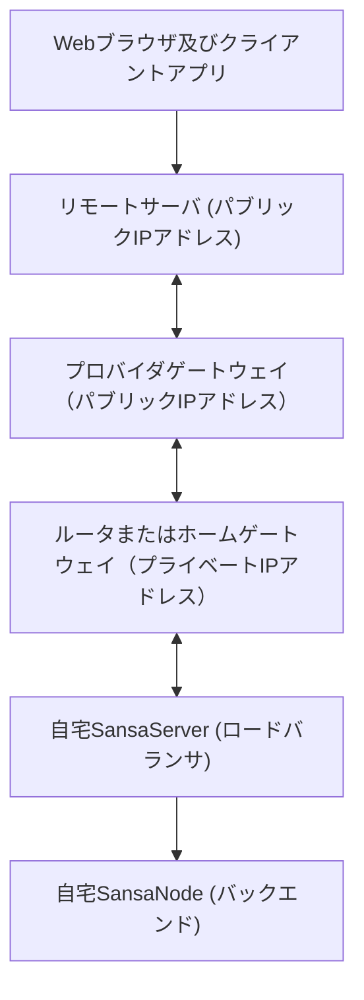

[目次](../目次.md) > サーバ環境構築 SSHリバーストンネルによるインターネット公開

## はじめに
自宅内でサーバを構築してインターネットに公開する場合、通常プロバイダから提供されているルータ（またはホームゲートウェイ）でポートフォワーディングの設定を行いますが、ルータの先がプロバイダのプライベートIPアドレスのケースがあります。この場合はインターネットからルータにたどり着けないため、公開できません。  
代替手段として、パブリックIPアドレスを持つリモートサーバを建てて、ローカルサーバからSSHで接続し、その通信経路を介してリモートサーバへのアクセスをローカルサーバに中継する方法について説明します。

## パブリックIPアドレスを持つリモートサーバを作成
自分の場合は Azure でSSHによる接続を有効にした最小構成の Ubuntu Server を作成しました。  
Azure の場合、パブリックIPアドレスを静的に設定すれば固定化されます。  
SSHの設定時に秘密キーを例えば sansa-dev-proxy_key.pem で保存します。  
以降の説明では sansa-dev-proxy_key.pem の部分は、自分の環境に合わせて変更してください。

## DNSの設定
ドメインサービスを利用している場合は、DNSレコードに以下を追加します。  
例えば sansa.com のようなドメインを持っている場合、開発用サブドメインが dev であれば、dev.sansa.com でリモートサーバにアクセスできるようになります。
   ```shell
   a {開発用サブドメイン} {リモートサーバのパブリックIPアドレス}
   ```
以降の説明では dev.sansa.com の部分は、自分の環境に合わせて変更してください。

## リモートサーバの設定
今回、リモートサーバにもNginxを入れ、ローカルサーバに転送する設定を行います。
1. Nginxをインストールします。  
   ここの「Nginxのインストール」の項を参照してください。  
   [UbuntuとNginxのインストール](UbuntuとNginxのインストール.md)

1. Nginxのサイト設定ファイルをリバースプロキシ用に作成します。
   ```shell
   sudo nano /etc/nginx/sites-available/dev.sansa.com
   ```
1. 以下のように編集して保存します。
   ```yaml
   map $http_upgrade $connection_upgrade {
       default upgrade;
       '' close;
   }

   server {
       listen 80;
       server_name dev.sansa.com;

       # HTTPからHTTPSへのリダイレクト
       return 301 https://$server_name$request_uri;

       #location / {
       #    proxy_pass http://localhost:8080;
       #    proxy_set_header Host $host;
       #    proxy_set_header X-Real-IP $remote_addr;
       #    proxy_set_header X-Forwarded-For $proxy_add_x_forwarded_for;
       #    proxy_set_header X-Forwarded-Proto $scheme;
       #}
   }

   # SSLが不要な場合は、このブロックをすべてコメントアウト
   server {
       listen 443 ssl;
       server_name dev.sansa.com;

       # SSL設定: SSL証明書と秘密鍵のパスを指定（仮のもの）
       ssl_certificate /path/to/your/certificate.pem;
       ssl_certificate_key /path/to/your/private.key;

       location / {
           proxy_pass http://localhost:8443;
           proxy_set_header Host $host;
           proxy_http_version 1.1;
           proxy_set_header Upgrade $http_upgrade;
           proxy_set_header Connection $connection_upgrade;
           proxy_set_header X-Real-IP $remote_addr;
           proxy_set_header X-Forwarded-For $proxy_add_x_forwarded_for;
           proxy_set_header X-Forwarded-Proto $scheme;
       }
   }
   ```
1. 設定を反映します。
   ```shell
   sudo ln -s /etc/nginx/sites-available/dev.sansa.com /etc/nginx/sites-enabled/
   sudo nginx -t
   # エラーがなければNginxを再起動
   sudo systemctl restart nginx
   ```

## SSHリバーストンネルの設定
SSHが自動切断しないよう設定します。
1. SSHの設定ファイルを作成します。
   ```shell
   nano ~/.ssh/config
   ```
1. 以下のように編集して保存します。（キープアライブパケット送信/最大試行回数）
   ```yaml
   Host *
     ServerAliveInterval 60
     ServerAliveCountMax 120
   ```
SSHの認証キーを設定します。
1. SSHの認証キーを編集のため開きます。
   ```shell
   nano ~/.ssh/authorized_keys
   ```
1. 秘密キー sansa-dev-proxy_key.pem の内容を貼って保存します。

1. パーミッションの設定をします。
   ```shell
   chmod 600 ~/.ssh/authorized_keys
   ```
SSHリバーストンネルとNginxのリバースプロキシの動作を確認します。
1. 以下を実行してブラウザでリモートサーバ経由でローカルサーバに接続できるか確認します。  
   実行中のみSSHリバーストンネルが有効になります。  
   sshuser は実際にリモートサーバに接続するユーザに読み前てください。
   ```shell
   ssh -i .ssh/authorized_keys -N -R *:8080:localhost:80 -R *:8443:localhost:443 sshuser@dev.sansa.com
   ```
# SSHリバーストンネルの自動起動設定
接続できることが確認出来たら、サーバ起動時にリモートサーバに自動接続するよう設定します。
1. サービスの設定ファイルを作成します。
   dev-sansa.ssh-reverse-tunnel.service は自分の環境に合わせて変更してください。
   ```shell
   sudo nano /etc/systemd/system/dev-sansa.ssh-reverse-tunnel.service
   ```
1. 以下を貼り付けて保存します。
   ```ini
   [Unit]
   Description=dev-sansa SSH reverse tunnel service
   After=network.target
   
   [Service]
   User=mayusaki3
   ExecStart=/usr/bin/ssh -i /home/sshuser/.ssh/authorized_keys -N -R *:8080:localhost:80 -R *:8443:localhost:443 sshuser@dev.sansa.com
   Restart=always
   
   [Install]
   WantedBy=multi-user.target
   ```
1. サービスとして起動します。
   ```shell
   sudo systemctl daemon-reload
   sudo systemctl enable dev-sansa.ssh-reverse-tunnel.service
   sudo systemctl start dev-sansa.ssh-reverse-tunnel.service
   sudo systemctl status dev-sansa.ssh-reverse-tunnel.service
   # ログ調査
   # journalctl -u dev-sansa.ssh-reverse-tunnel.service
   ```
1. 再起動してもブラウザでリモートサーバ経由でローカルサーバに接続できるか確認します。

1. Hyper-V上の場合、Windowsの再起動時に Ubuntu も再起動するように設定します。  
設定 > 管理 > 自動開始アクション と 自動停止アクション

***
[目次](../目次.md) > サーバ環境構築 SSHリバーストンネルによるインターネット公開
